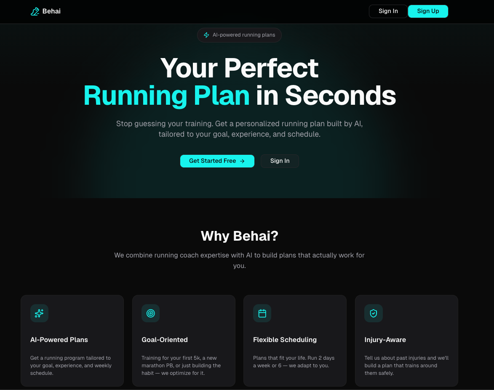
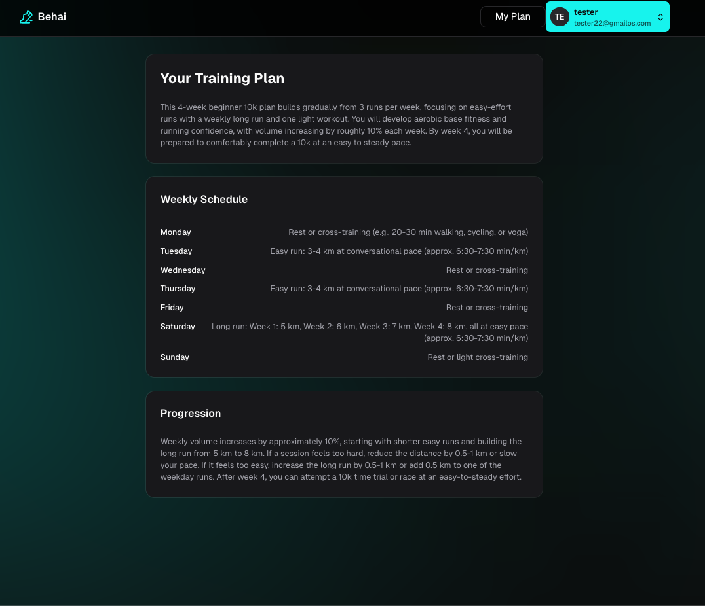

# BehAI




AI aplikácia na tvorbu personalizovaných tréningových plánov. Používateľ prejde onboardingom (cieľ, skúsenosti, frekvencia tréningov, prípadné zranenia), na základe čoho AI vygeneruje tréningový plán.

## Tech stack

- **Frontend**: React + TypeScript, Vite, Tailwind CSS, shadcn/ui
- **Backend**: Node.js, Express, TypeScript, Prisma (PostgreSQL)
- **AI**: OpenAI SDK (cez OpenRouter)
- **Auth**: Neon Auth

## Spustenie

### Frontend

```bash
npm install
npm run dev
```

Vytvor `.env` v roote projektu:

```
VITE_API_URL=...
VITE_NEON_AUTH_URL=...
```

### Backend

```bash
cd server
npm install
npm run dev:server
```

Vytvor `server/.env`:

```
PORT=...
BASE_URL=...
DATABASE_URL=...
OPEN_ROUTER_KEY=...
```

Pred prvým spustením je potrebné vygenerovať Prisma klienta a aplikovať migrácie:

```bash
npx prisma generate
npx prisma migrate deploy
```

## AI modely (OpenRouter)

Použité modely sú natvrdo nastavené v [server/lib/ai.ts](server/lib/ai.ts) (funkcia `generateTrainingPlan`, `model` + `models` fallback zoznam).

Momentálne sa používajú free modely z OpenRouteru. OpenRouter free modely pomerne často mení, ruší alebo dočasne preťažuje/vyraďuje z voľnej ponuky, takže ak generovanie plánu hádže 404/503 chybu, je potrebné v `server/lib/ai.ts` vymeniť slugy modelov za aktuálne dostupné free modely — aktuálny zoznam je na [openrouter.ai/models](https://openrouter.ai/models) (filter `Free`).
